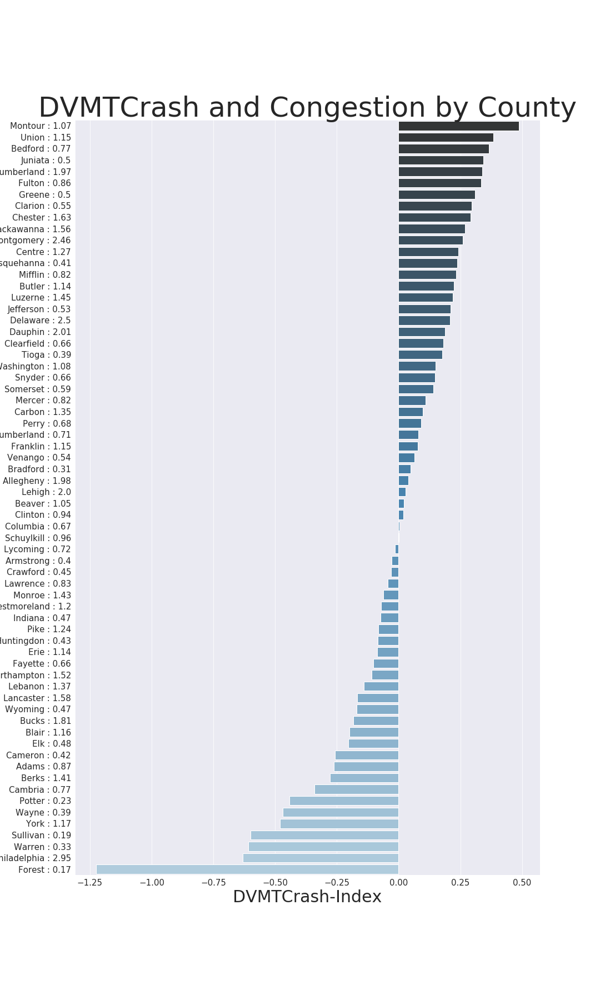

# PA Motorcycle Crash Data & Analysis by County

---

## Summary
* Are some counties in Pennsylvania safer for motorcyclists than others? Why?
* This project will look to answer the first question above. The 'Why?' will be added at a later time.

---

## Resources Used
The following resources were used to collect data for this project:
* [PA Crash Incident](https://data.pa.gov/Public-Safety/Crash-Incident-Details-CY-1997-Current-Annual-Coun/dc5b-gebx)
    * This dataset contains all PA crash records from 1997 - 2017.
    * Data was taken from the csv file located here and imported into a local database called 'crash-data.db'
* [PA Population Data](https://worldpopulationreview.com/us-counties/pa/)
    * Data was taken from the csv file located here and imported into the local database called 'crash-data.db'
* [2018 PA Highway Data](https://www.dot.state.pa.us/public/pubsforms/Publications/PUB%20600.pdf)
    * Linear Mileage and DVMT (Daily Vehicle Miles Traveled) by county were found in this pdf.
    * A tool called [tabula](https://tabula.technology/) was used to extract table data and was then imported into the local database called 'crash-data.db'
    
---

## Database Creation
Sqlite3 was used for creating the local database. If you wish to run my code, you can set up the database using the following commands in sqlite3 or any other way you see fit. Make sure to change the jupyter notebook accordingly. I named my database 'crash-data.db'
```sqlite3
### Change mode to csv
> .mode csv
### Import FILE to TABLE
> .import Crash-Indicent-Details-CY-1997-Current-Annual-County-Transportation.csv crashes
> .import pa-county-pop-data.csv PA_County_Population
### Import the files created using the 2018 Highway Data and Tabula
> .import PA2018HS-linearmiles.csv PA_County_LinearMiles
> .import PA2018HS-dvmt.csv PA_County_DVMT
```
I now have four tables in my local database that are references in my jupyter notebook using the python-sqlite3 library.

---

## Python Code

The data cleaning, manipulation, and visualization was done using python in the attached jupyter notebook:
* [MotorcycleCrashesByCounty](MotorcycleCrashesByCounty.ipynb)

---

## Analysis
Are some counties in Pennsylvania safer for motorcyclists than others?

I believe there are. My analysis uses two different indicies to make this conclusion.
* The first index is a metric I named the 'Congestion-Index'. This index essentially measures vehicle traffic by mile for each county relative to other counties in the state.
    * The 'Congestion-Index' is calculated by taking (per county) the DVMT (daily vehicle miles traveled) and dividing by the linear miles to get a county traffic by single linear mile. For each county, this metric is then divided by the average of all county's traffic by single linear mile to get a relative index.
    * The values of this index can range from 0 - \infty, with a value of 1 being equal to the baseline, and a larger number showing more congestion than the baseline.
* The second metric looks at motorcycle crashes to DVMT. I've named this one the 'DVMTCrash-Index'. 
    * The 'DVMTCrash-Index' is calculated using the % to total PA motorcycle crashes by county (Crash%) and the % to total PA DVMT by county (DVMT%). Subtract the Crash% from the DVMT%. Then divide that result by the DVMT%. This number is the 'DVMTCrash-Index'.
    * Since different counties have different populations, different linear road mileage, and different DVMT, we must consider at least one of these factors when looking at motorcycle crashes by county. DVMT is the best of the three metrics to show the volume of vehicles on the road by county.
    * % to total PA values are used in order to make each county relative to another within PA.
    * The values of this index can range from -\infty - \infty.

A visualization of each county's Congestion-Index (attached to y-axis labels) and DVMTCrash-Index (plotted):


We can see here that the county with the highest DVMTCrash-Index is Montour, at almost .5, with a 1.07 Congestion-Index. The county with the lowest DVMTCrash-Index is Forest, at almost -1.25 and a Congestion-Index of .17. While Congestion in Forest county is relatively low to other counties, they have more motorcycle crashes per vehicle mile driven than any other county. This might indicate poor road conditions, an abundance of curved roads, or even an area more prone to incliment weather.

Another good comparison from the above bar plot is the variation in DVMTCrash-Index values for Montgomery and Philedelphia Counties. Both have high Congestion-Index values (2.46 and 2.95 respectively). These counties fall on different ends of the DVMTCrash-Index. Montgomery County has much less motorcycle crashes per daily vehicle mile driven than Philedelphia County. While there may be many reasons for this, including Philedelphia county seeing much higher volume of motorcycle specific traffic than Montgomery, if one were to make the assumption that motorcycle use amongst all PA counties are consistent, then you can say the Montgomery County is safer for motorcyclists than Philedelphia. That brings me to my conclusion for this part of the project.

My conclusion is that, with the assumption that motorcycle use is proportionate between counties in PA, certain counties are safer for motorcyclists than others.

