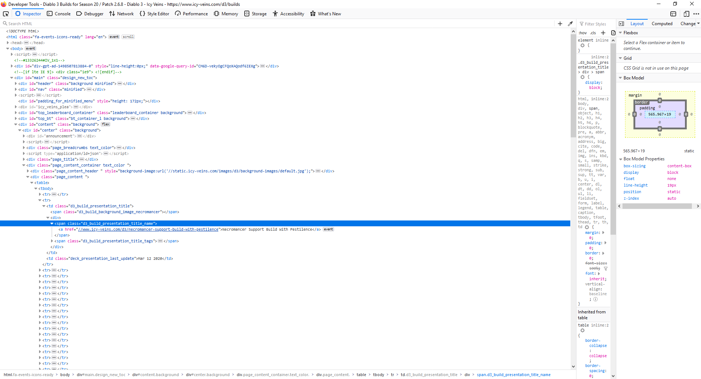
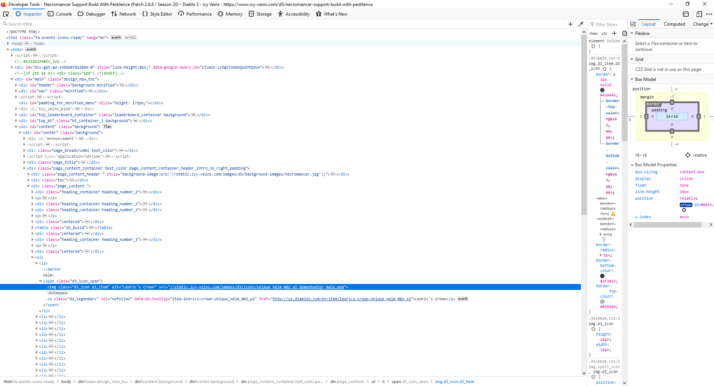
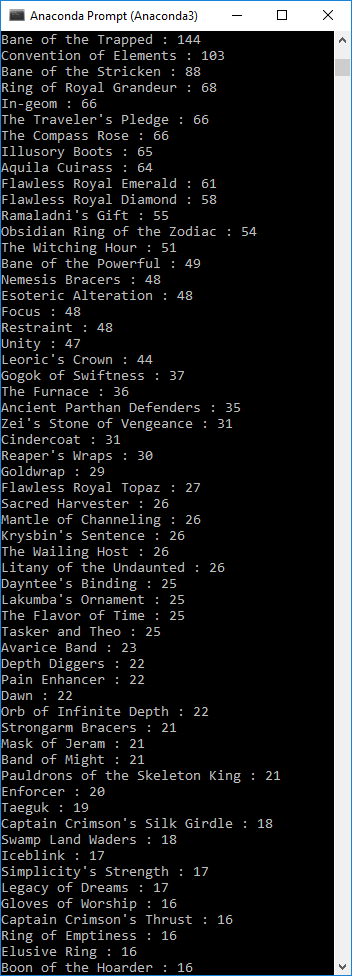

# D3-ItemCounter.py

This python script is used for webscraping Icy-Veins website and their Diablo 3 builds.
The purpose of this script is to count the number of times an item appears in different builds. It then sorts the items by count, in descending order and prints the findings.

## HTML 1

The below screenshot shows the html for the webpage including a list of all Diablo 3 builds. The highlighted line shows where I am retrieving the link to that specific build's webpage.

## HTML 2

The below screenshot shows the html for the build's webpage. The highlighted line shows where I retrieved the name of one of the item's used in that build.

## Output

The below screenshot shows the output when I run the code in my Anaconda Prompt. You can the highest used items in this image.

